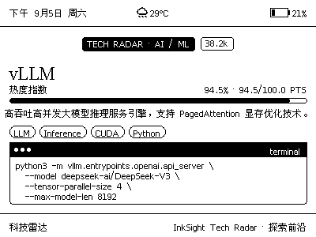
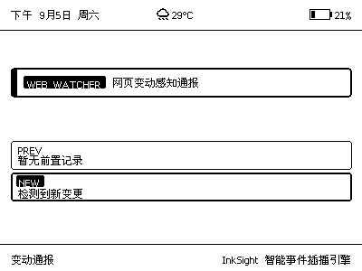
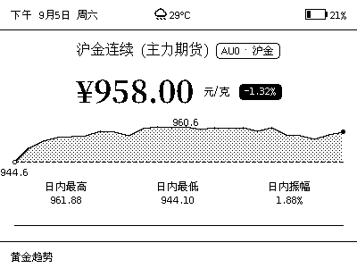
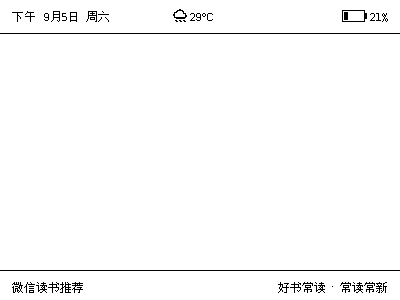
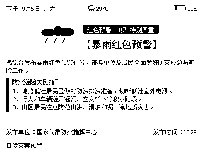

# InkSight E-Ink Layout Blocks & Mode Specification

This guide documents the low-level layout blocks and widget systems designed specifically for InkSight e-ink displays, detailing parameters, JSON definitions, and real rendering screenshot previews.

---

## Table of Contents

1. [Design Guidelines](#1-design-guidelines)
2. [Geek Widgets](#2-geek-widgets)
   - [2.1 stat_progress_bar](#21-stat_progress_bar)
   - [2.2 pill_tag_list](#22-pill_tag_list)
   - [2.3 code_snippet_box](#23-code_snippet_box)
3. [Monitoring & Interceptors](#3-monitoring--interceptors)
   - [3.1 alert_callout](#31-alert_callout)
   - [3.2 change_diff_card](#32-change_diff_card)
   - [3.3 timeline_event](#33-timeline_event)
4. [Charts & Visual Media](#4-charts--visual-media)
   - [4.1 sparkline_chart](#41-sparkline_chart)
   - [4.2 image](#42-image)
5. [Mode Previews & Screenshots](#5-mode-previews--screenshots)

---

## 1. Design Guidelines

- **Zero Emoji Policy**: E-ink displays operate on 1-bit or 4-color palettes. Emojis cause font fallbacks or garbled glyph boxes. Use clean ASCII symbols (`·`, `>`, `#`) or vector icons instead.
- **Mandatory Measurement**: Every block must implement size measurement in `core/blocks/measure.py` so container elements (`flex_row`, `two_column`) and screen height bounds can be computed accurately without footer line crossing.

---

## 2. Geek Widgets

### 2.1 stat_progress_bar
Displays metric progress with a top label and value percentage, backed by a rounded progress groove with proportional fill.

```json
{
  "type": "stat_progress_bar",
  "label": "Trending Score",
  "value_field": "trend_score",
  "max_value": 100,
  "unit": "PTS",
  "margin_x": 12,
  "height": 6,
  "show_percent": true,
  "margin_bottom": 6
}
```

### 2.2 pill_tag_list
Flowing capsule tags cloud that automatically wraps based on remaining container width.

```json
{
  "type": "pill_tag_list",
  "field": "tags",
  "margin_x": 12,
  "font_size": 9,
  "variant": "outline",
  "margin_bottom": 6
}
```

### 2.3 code_snippet_box
Terminal-inspired window with a three-dot header titlebar and monospace code lines.

```json
{
  "type": "code_snippet_box",
  "title_field": "snippet_title",
  "field": "code_snippet",
  "margin_x": 12,
  "font_size": 9,
  "margin_bottom": 4
}
```

---

## 3. Monitoring & Interceptors

### 3.1 alert_callout
High-priority notification banner with accent border and level tags.

### 3.2 change_diff_card
Side-by-side or stacked diff card highlighting PREVIOUS state vs NEW updated state.

---

## 4. Charts & Visual Media

### 4.1 sparkline_chart
24-point intraday financial trendline with extreme value guides and area filling.

### 4.2 image
Local or remote image rendering with dithering and containment inside multi-column cards.

---

## 5. Mode Previews & Screenshots

Rendered on InkSight 400x300 e-ink target screens:

### Tech Radar (`TECH_RADAR`)


### Web Change Notice (`WEB_NOTICE`)


### Gold & Bullion Market (`GOLD`)


### WeChat Read Book Recommendation (`WECHAT_READ`)


### Disaster Warning (`DISASTER_ALERT`)

