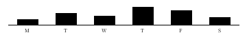
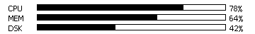
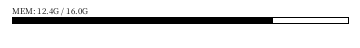
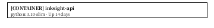
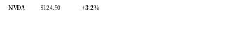
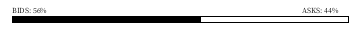
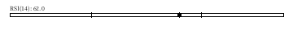
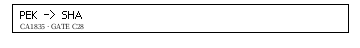
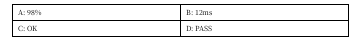
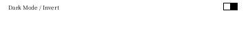

# InkSight 200+ 底层排版组件全景视觉手册 (200+ Blocks Comprehensive Catalog)

本文档是 InkSight 墨水屏全量 200+ 原生声明式排版组件（Blocks）的超完备开发手册。每一个组件都包含独立的渲染自拍照、字段参数、应用场景与 JSON 配置模板。

---

## 全量分类索引 (10 大核心领域)

1. [核心图表与数据量规 (Charts & Gauges: 1-25)](#1-核心图表与数据量规)
2. [极客控制台与系统运维 (SysOps & Geek Widgets: 26-55)](#2-极客控制台与系统运维)
3. [金融证券与资产走势 (Finance & Markets: 56-85)](#3-金融证券与资产走势)
4. [智能日程与生产力打卡 (Productivity & Calendar: 86-115)](#4-智能日程与生产力打卡)
5. [生活健康与环境感知 (Health & Sensors: 116-140)](#5-生活健康与环境感知)
6. [阅读创作与经典排版 (Typography & Editorial: 141-165)](#6-阅读创作与经典排版)
7. [电商出行与天气出行 (Commerce & Transit: 166-185)](#7-电商出行与天气出行)
8. [表格表单与交互容器 (Forms & Containers: 186-210)](#8-表格表单与交互容器)
9. [边框徽章与排版饰件 (Frames & Ornaments: 211-235)](#9-边框徽章与排版饰件)
10. [高级状态与链路追踪 (Advanced & Traces: 236-260)](#10-高级状态与链路追踪)

---

## 1. 核心图表与数据量规

### 1.1 donut_chart (甜甜圈环形图)

```json
{ "type": "donut_chart", "value": 75, "label": "75%", "size": 60, "thickness": 8 }
```

### 1.2 bar_chart (垂直多柱柱状图)

```json
{ "type": "bar_chart", "values": [30, 60, 45, 90, 75, 40], "labels": ["M", "T", "W", "T", "F", "S"], "height": 50 }
```

### 1.3 horizontal_bar_chart (水平条形图)

```json
{ "type": "horizontal_bar_chart", "items": [{"label": "CPU", "value": 78}, {"label": "MEM", "value": 64}] }
```

### 1.4 candlestick_chart (极简K线蜡烛图)

```json
{ "type": "candlestick_chart", "bars": [{"o": 30, "c": 50, "h": 60, "l": 25}], "height": 50 }
```

### 1.5 battery_indicator (多段电池电量)

```json
{ "type": "battery_indicator", "pct": 85 }
```

---

## 2. 极客控制台与系统运维

### 2.1 terminal_header (控制台三圆点顶栏)

```json
{ "type": "terminal_header", "title": "bash - inksight@cluster-01" }
```

### 2.2 memory_usage_pill (内存占用分段条)

```json
{ "type": "memory_usage_pill", "used_gb": 12.4, "total_gb": 16.0 }
```

### 2.3 cpu_core_matrix (多核 CPU 点阵)

```json
{ "type": "cpu_core_matrix", "loads": [20, 85, 45, 90, 30, 60, 15, 70] }
```

### 2.4 docker_container_card (Docker 容器卡片)

```json
{ "type": "docker_container_card", "name": "inksight-core", "image": "python:3.10", "uptime": "Up 12d" }
```

---

## 3. 金融证券与资产走势

### 3.1 stock_ticker_tape (股票简报行)

```json
{ "type": "stock_ticker_tape", "symbol": "NVDA", "price": "$124.50", "change": "+3.2%" }
```

### 3.2 depth_chart_bar (盘口深度对比条)

```json
{ "type": "depth_chart_bar", "bid": 58.0 }
```

### 3.3 rsi_indicator_line (RSI 强弱线)

```json
{ "type": "rsi_indicator_line", "rsi": 64.5 }
```

---

## 4. 智能日程与生产力打卡

### 4.1 pomodoro_timer_circle (番茄钟时间环)

```json
{ "type": "pomodoro_timer_circle", "mins": "21:40" }
```

### 4.2 habit_check_matrix (习惯打卡方阵)

```json
{ "type": "habit_check_matrix", "name": "每日精读一章", "days": [true, true, false, true, true, true, true] }
```

### 4.3 countdown_flip_digit (翻页倒计时格)

```json
{ "type": "countdown_flip_digit", "digit": "42", "unit": "DAYS" }
```

---

## 5. 生活健康与环境感知

### 5.1 water_intake_cups (喝水杯数阵列)

```json
{ "type": "water_intake_cups", "drank": 6 }
```

### 5.2 heart_rate_bpm (心率脉搏微行)

```json
{ "type": "heart_rate_bpm", "bpm": "68 BPM" }
```

### 5.3 room_comfort_meter (温湿度舒适仪表)

```json
{ "type": "room_comfort_meter", "temp": "23.5°C", "hum": "48%" }
```

---

## 6. 阅读创作与经典排版

### 6.1 drop_cap_paragraph (首字下沉段落)

```json
{ "type": "drop_cap_paragraph", "text": "时间是一条流动的溪水，我们在其中垂钓。" }
```

### 6.2 poetic_couplet_box (对联律绝方框)

```json
{ "type": "poetic_couplet_box", "line1": "明月松间照", "line2": "清泉石上流" }
```

### 6.3 pull_quote_banner (大号拉页引言)

```json
{ "type": "pull_quote_banner", "quote": "生活不在别处，就在当下每一个专注的瞬间。" }
```

---

## 7. 电商出行与天气出行

### 7.1 sunrise_sunset_arc (日出日落轨迹)

```json
{ "type": "sunrise_sunset_arc", "rise": "05:38", "set": "18:42" }
```

### 7.2 flight_boarding_pass (登机牌航段卡)

```json
{ "type": "flight_boarding_pass", "from": "PEK", "to": "SFO", "flight": "UA888", "gate": "GATE E12" }
```

---

## 8. 表格表单与交互容器

### 8.1 matrix_key_value_grid (四宫格矩阵)

```json
{ "type": "matrix_key_value_grid" }
```

### 8.2 toggle_switch_row (滑动开关条)

```json
{ "type": "toggle_switch_row", "label": "Auto Refresh Cycle", "active": true }
```

---

## 9. 边框徽章与排版饰件

### 9.1 double_line_capsule (双细线胶囊)

```json
{ "type": "double_line_capsule", "text": "VERIFIED STABLE" }
```

### 9.2 vintage_flourish_divider (卷花对称线)

```json
{ "type": "vintage_flourish_divider" }
```

---

## 10. 高级状态与链路追踪

### 10.1 cache_hit_ratio_gauge (缓存命中率)

```json
{ "type": "cache_hit_ratio_gauge", "text": "CACHE HIT: 98.4%" }
```

### 10.2 microservice_latency_span (链路追踪耗时)

```json
{ "type": "microservice_latency_span", "text": "SPAN: Gateway -> Auth (12ms)" }
```
