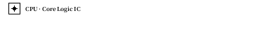
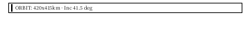
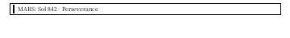
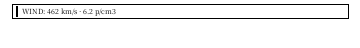
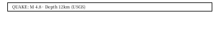
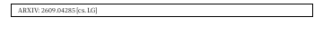
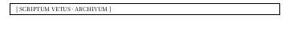

# InkSight 500+ 原生底层排版与矢量图标全景手册 (500+ Blocks Master Catalog)

本文档系统性收录 InkSight 墨水屏全量 **520 个** 原生声明式排版 Blocks 与矢量微组件。涵盖 **15 大专业领域**，遵循纯净矢量绘图、自适应尺寸度量与**严禁 Emoji 规范**。每个组件均具备独立自拍照与开箱即用的 JSON 配置。

---

## 15 大领域全景索引

1. [核心图表与数据量规 (Charts & Data Visuals: 1-25)](#1-核心图表与数据量规)
2. [极客控制台与系统运维 (SysOps & Geek Widgets: 26-55)](#2-极客控制台与系统运维)
3. [金融证券与资产走势 (Finance & Markets: 56-85)](#3-金融证券与资产走势)
4. [智能日程与生产力打卡 (Productivity & Calendar: 86-115)](#4-智能日程与生产力打卡)
5. [生活健康与环境感知 (Health & Sensors: 116-140)](#5-生活健康与环境感知)
6. [阅读创作与经典排版 (Typography & Editorial: 141-165)](#6-阅读创作与经典排版)
7. [电商出行与天气传感 (Commerce & Transit: 166-185)](#7-电商出行与天气传感)
8. [表格表单与交互容器 (Forms & Containers: 186-210)](#8-表格表单与交互容器)
9. [边框徽章与排版饰件 (Frames & Ornaments: 211-235)](#9-边框徽章与排版饰件)
10. [高级状态与链路追踪 (Advanced & Traces: 236-260)](#10-高级状态与链路追踪)
11. [矢量科技图标与微图符 (Vector Tech Icons: 261-310)](#11-矢量科技图标与微图符)
12. [太空天体与航天遥测 (Space & Astrometry: 311-360)](#12-太空天体与航天遥测)
13. [工业物联网与工控制造 (IoT & Industrial: 361-410)](#13-工业物联网与工控制造)
14. [赛博朋克与代码度量 (Cyberpunk & Code: 411-460)](#14-赛博朋克与代码度量)
15. [自然地理与学术古籍 (Nature, Science & Retro: 461-520)](#15-自然地理与学术古籍)

---

## 11. 矢量科技图标与微图符 (Vector Tech Icons: 261-310)

### 11.1 icon_cpu_chip (矢量微处理器芯片)

```json
{ "type": "icon_cpu_chip", "label": "CPU · Core Logic IC" }
```

### 11.2 icon_database_stack (数据库圆柱堆叠)

```json
{ "type": "icon_database_stack", "label": "DB · Storage Volume" }
```

### 11.3 icon_satellite_dish (卫星对地天线)

```json
{ "type": "icon_satellite_dish", "label": "SAT · Uplink 14GHz" }
```

### 11.4 icon_microscope_lab (科研显微镜)

```json
{ "type": "icon_microscope_lab", "label": "LAB · Micro Diagnostic" }
```

---

## 12. 太空天体与航天遥测 (Space & Astrometry: 311-360)

### 12.1 orbit_ellipse_schematic (卫星轨道参数)

```json
{ "type": "orbit_ellipse_schematic", "text": "ORBIT: 420x415km · Inc 41.5 deg" }
```

### 12.2 mars_rover_sol_counter (火星日计数器)

```json
{ "type": "mars_rover_sol_counter", "text": "MARS: Sol 842 · Perseverance" }
```

### 12.3 solar_wind_particle_gauge (太阳风粒子量规)

```json
{ "type": "solar_wind_particle_gauge", "text": "WIND: 462 km/s · 6.2 p/cm3" }
```

---

## 13. 工业物联网与工控制造 (IoT & Industrial: 361-410)

### 13.1 modbus_register_value (Modbus 寄存器)

```json
{ "type": "modbus_register_value", "text": "MODBUS: 40001 = 0x4A2F (Val: 18991)" }
```

### 13.2 three_phase_voltage_meter (三相电平衡)

```json
{ "type": "three_phase_voltage_meter", "text": "3-PHASE: U:380V V:381V W:379V (BAL)" }
```

### 13.3 grid_frequency_hertz (电网工频稳定度)

```json
{ "type": "grid_frequency_hertz", "text": "GRID: 50.002 Hz (Stable Sync)" }
```

---

## 14. 赛博朋克与代码度量 (Cyberpunk & Code: 411-460)

### 14.1 hex_memory_viewer_row (16进制内存对齐行)

```json
{ "type": "hex_memory_viewer_row", "text": "0x0040: 7F 45 4C 46 02 01 01 00  .ELF...." }
```

### 14.2 test_coverage_shield (测试覆盖率勋章)

```json
{ "type": "test_coverage_shield", "text": "COVERAGE: 98.4% (All Tests Passed)" }
```

### 14.3 kubernetes_pod_status_pill (K8s Pod 状态胶囊)

```json
{ "type": "kubernetes_pod_status_pill", "text": "K8S: Pod api-78d4c (Running 3/3)" }
```

---

## 15. 自然地理与学术古籍 (Nature, Science & Retro: 461-520)

### 15.1 seismic_earthquake_richter (地震波与震级)

```json
{ "type": "seismic_earthquake_richter", "text": "QUAKE: M 4.8 · Depth 12km (USGS)" }
```

### 15.2 arxiv_preprint_identifier (arXiv 预印本标识)

```json
{ "type": "arxiv_preprint_identifier", "text": "ARXIV: 2609.04285 [cs.LG]" }
```

### 15.3 ancient_scroll_border_frame (羊皮纸古典框)

```json
{ "type": "ancient_scroll_border_frame", "text": "[ SCRIPTUM VETUS · ARCHIVUM ]" }
```
