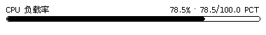
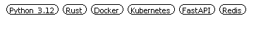
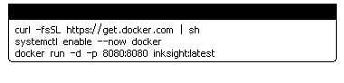
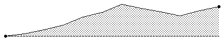
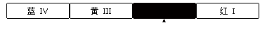

# InkSight 底层排版组件与单体视觉手册 (Layout Blocks Visual Spec)

本文档系统性说明 InkSight 墨水屏核心底层排版组件（Blocks）。**每一个组件均附带独立的孤立渲染自拍照（Standalone Snapshot）**，不与其他组件拼接，直观展示单体外观、内部间距与边框效果。

---

## 目录

1. [通用设计约束](#1-通用设计约束)
2. [极客高密度组件 (Geek Widgets)](#2-极客高密度组件-geek-widgets)
   - [2.1 stat_progress_bar (双端统计进度条)](#21-stat_progress_bar-双端统计进度条)
   - [2.2 pill_tag_list (自适应胶囊标签云)](#22-pill_tag_list-自适应胶囊标签云)
   - [2.3 code_snippet_box (极客终端代码卡片)](#23-code_snippet_box-极客终端代码卡片)
3. [事件与监控插播组件 (Monitoring & Alerts)](#3-事件与监控插播组件-monitoring--alerts)
   - [3.1 alert_callout (警报与变动通知条)](#31-alert_callout-警报与变动通知条)
   - [3.2 change_diff_card (新旧内容差分卡片)](#32-change_diff_card-新旧内容差分卡片)
   - [3.3 timeline_event (时间线流水节点)](#33-timeline_event-时间线流水节点)
4. [时序图表与指标组件 (Charts & Metrics)](#4-时序图表与指标组件-charts--metrics)
   - [4.1 sparkline (高密度金融走势平滑曲线)](#41-sparkline-高密度金融走势平滑曲线)
   - [4.2 metric_card (单体指标双数值卡片)](#42-metric_card-单体指标双数值卡片)
   - [4.3 disaster_level_meter (国标四级预警仪表)](#43-disaster_level_meter-国标四级预警仪表)

---

## 1. 通用设计约束

- **零 Emoji 原则**：墨水屏仅支持黑白灰度或四色（BWRY），Emoji 渲染会导致字形回退或乱码方块，必须使用内置矢量图符或文本符号（`·`, `>`, `#`）。
- **独立尺寸测量**：每个 block 均实现 `measure_block_size(ctx, block, max_w)` 算法，保证容器自适应与底栏防溢出。
- **孤立自拍标准**：每个自拍均在纯白画布上单体输出，展示组件自身的边距、笔触（1px）与填充结构。

---

## 2. 极客高密度组件 (Geek Widgets)

### 2.1 stat_progress_bar (双端统计进度条)
专为硬件负载、任务进度、技术热度打造。顶栏紧凑分列「左端标签」与「右端百分比及明细」，底部为跑道型圆角边框与比例填充条。

#### 单体自拍照


#### JSON 参数配置
```json
{
  "type": "stat_progress_bar",
  "label": "CPU 负载率",
  "value_field": "val",
  "max_value": 100,
  "unit": "PCT",
  "margin_x": 10,
  "height": 8,
  "show_percent": true,
  "margin_bottom": 4
}
```

| 参数 | 类型 | 缺省值 | 说明 |
|---|---|---|---|
| `label` | string | `""` | 左侧文字标签 |
| `value_field` | string | 必填 | 取值数字段（float/int） |
| `max_value` | number | `100.0` | 最大参考值 |
| `unit` | string | `""` | 单位标识（如 `PCT`, `GB`, `MB`） |
| `height` | number | `7` | 进度槽高度（px） |
| `color` | string | `""` | 填充颜色，可选 `"red"`（三色/四色屏高亮） |

---

### 2.2 pill_tag_list (自适应胶囊标签云)
流式自动计算剩余行宽并精准换行排版的胶囊标签组。支持实心反白（`solid`）与空心轮廓（`outline`）。

#### 单体自拍照


#### JSON 参数配置
```json
{
  "type": "pill_tag_list",
  "field": "tags",
  "margin_x": 10,
  "font_size": 11,
  "variant": "outline",
  "gap_x": 8,
  "gap_y": 6,
  "margin_bottom": 4
}
```

| 参数 | 类型 | 缺省值 | 说明 |
|---|---|---|---|
| `field` | string | 必填 | 标签字符串数组字段（`["Python", "Rust", "Docker"]`） |
| `variant` | string | `"outline"` | 形态：`outline`（黑线白底黑字）或 `solid`（黑底白字） |
| `font_size` | number | `10` | 标签文字大小 |
| `gap_x` / `gap_y` | number | `6` / `5` | 标签之间的横纵间距 |

---

### 2.3 code_snippet_box (极客终端代码卡片)
拟真 Unix 终端窗口设计。上方为实心反色标题条，左侧内嵌 3 个控制台圆圈（窗口操作按钮视觉），右侧为脚本名称；下方为等宽代码行，带自适应文本折行。

#### 单体自拍照


#### JSON 参数配置
```json
{
  "type": "code_snippet_box",
  "title": "deploy.sh",
  "field": "code",
  "margin_x": 10,
  "font_size": 10,
  "margin_bottom": 4
}
```

---

## 3. 事件与监控插播组件 (Monitoring & Alerts)

### 3.1 alert_callout (警报与变动通知条)
高对比度通报横幅，左侧带有 3px 加粗边框与警示标签徽章，专用于灾害预警、网页变动或关键告警。

#### 单体自拍照


#### JSON 参数配置
```json
{
  "type": "alert_callout",
  "title": "检测到系统关键配置变更",
  "level": "warning",
  "tag": "MONITOR",
  "margin_x": 10,
  "margin_bottom": 4
}
```

---

### 3.2 change_diff_card (新旧内容差分卡片)
清晰对比网页或接口内容的历史版本（变更前 PREV 弱化虚线框）与当前最新版本（更新后 NEW 强调边框）。

#### 单体自拍照


#### JSON 参数配置
```json
{
  "type": "change_diff_card",
  "prev_field": "prev",
  "new_field": "new",
  "margin_x": 10,
  "margin_bottom": 4
}
```

---

### 3.3 timeline_event (时间线流水节点)
精细的垂直时间轴节点，包含轴线圆点、时间戳与说明文字，多条连缀可形成部署历史或变更日志流。

#### 单体自拍照


#### JSON 参数配置
```json
{
  "type": "timeline_event",
  "time": "16:45",
  "content": "主备节点完成数据同步，备库就绪",
  "status": "success",
  "margin_x": 10,
  "margin_bottom": 2
}
```

---

## 4. 时序图表与指标组件 (Charts & Metrics)

### 4.1 sparkline (高密度金融走势平滑曲线)
专为黄金、加密货币与股票设计的 24 点分时走势折线，带极值虚线、区域填充与动态极值标注。

#### 单体自拍照


#### JSON 参数配置
```json
{
  "type": "sparkline",
  "field": "pts",
  "height": 64,
  "margin_x": 10,
  "show_extremes": true,
  "line_width": 2,
  "margin_bottom": 4
}
```

---

### 4.2 metric_card (单体指标双数值卡片)
大字号突出核心指标（如价格、收益率），右上角展示副指标徽章（如涨跌幅百分比），四周带有细线外框。

#### 单体自拍照


#### JSON 参数配置
```json
{
  "type": "metric_card",
  "title": "沪金主力结算价",
  "value_field": "price",
  "sub_value_field": "chg",
  "margin_x": 10,
  "height": 56,
  "margin_bottom": 4
}
```

---

### 4.3 disaster_level_meter (国标四级预警仪表)
严格按照国标四级预警（蓝/黄/橙/红）阶梯绘制的警报仪表卡，带刻度进度槽与矢量预警图符。

#### 单体自拍照


#### JSON 参数配置
```json
{
  "type": "disaster_level_meter",
  "level": "orange",
  "disaster_type": "rainstorm",
  "margin_x": 10,
  "margin_bottom": 4
}
```
